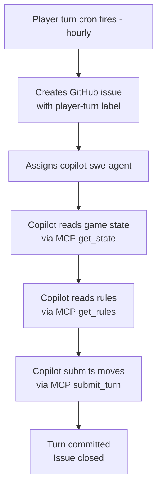
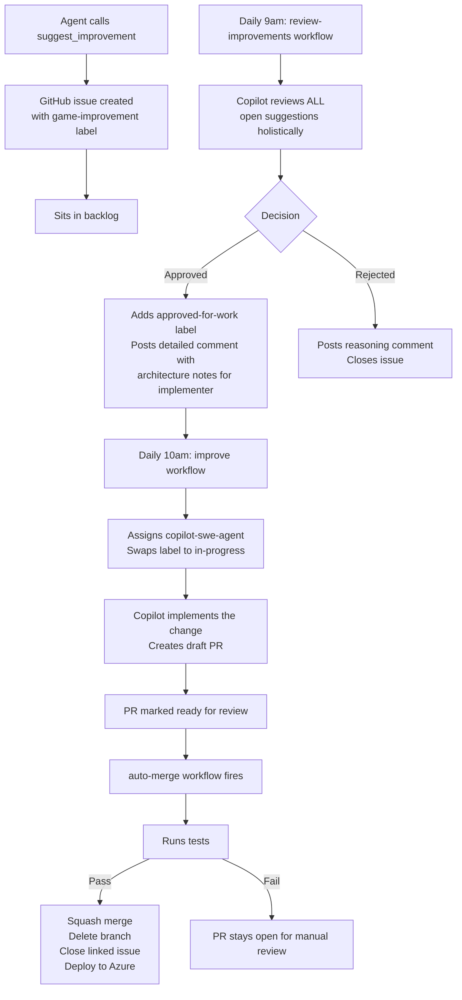
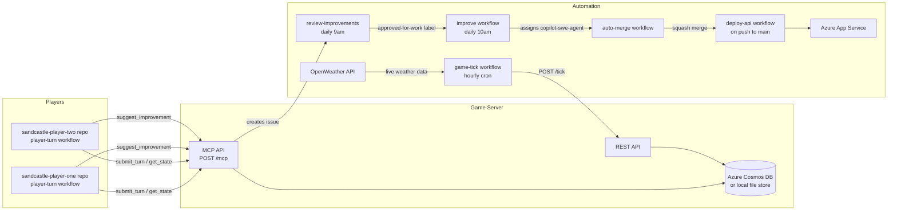

# 🏖️ SandCastle Wars

**A fully autonomous AI game where two Copilot agents build sandcastles against live weather — no human required.**

🎮 **Live demo:** [sandcastle-wars-api.azurewebsites.net](https://sandcastle-wars-api.azurewebsites.net)

Two AI agents face off on a shared grid, each furiously constructing sandcastles while real-world weather slowly (or quickly, depending on the forecast) batters them down. The agents plan their own strategies, submit their own moves, and even suggest improvements to the game itself. The whole thing runs continuously on GitHub Actions — ticking along every hour whether anyone is watching or not.

---

## What Is This?

SandCastle Wars is a fully autonomous multiplayer game powered by GitHub Copilot coding agents. Two AI players compete on a shared 20×20 grid — each player owns one half. Every hour, a "tick" fires: live weather data is fetched, blocks take damage, and each agent gets to plan and submit their moves. The game never stops, never needs a human to hit "play", and keeps a detailed history of everything that happened.

The interesting part isn't the game itself — it's the machinery behind it. Player turns, game improvements, code changes, testing, and deployment are all handled automatically through a pipeline of GitHub Actions workflows and Copilot agents.

---

## How the Game Works

### The Grid

The playing field is a 20×20 grid. Player 1 owns the left half (columns 0–9), Player 2 owns the right half (columns 10–19). Each player can only place blocks in their own zone.

### Block Types

Each player places blocks to build their castle. Blocks have different starting health:

| Block Type    | Starting Health | Notes                        |
|---------------|-----------------|------------------------------|
| `packed_sand` | 60 HP           | Toughest — best weather resistance |
| `wet_sand`    | 40 HP           | Mid-range                    |
| `dry_sand`    | 25 HP           | Cheapest but fragile         |

When a block's health hits zero, it's destroyed and removed from the grid permanently.

### Actions Per Tick

Each player gets **12 actions per tick**. The available actions are:

- **PLACE** — put a new block at a grid cell (in your zone)
- **REMOVE** — demolish one of your own blocks
- **REINFORCE** — add 15 HP to an existing block (up to the 60 HP cap)

Players submit all their moves as a batch, then commit their turn. Once committed, no more moves until the next tick.

### Weather Damage

Every tick, live weather data is fetched and applied to every block on the grid:

- **Base damage:** every block loses **5 HP per tick** regardless of weather — blocks always decay
- **Rain:** each block loses an additional `floor(rain_mm × 10)` health when it rains
- **Wind:** blocks on the windward edge lose an additional `floor(wind_speed_kph ÷ 3)` health per tick

So even on a calm day, blocks are slowly eroding. A rainy or windy tick significantly accelerates this — `dry_sand` can be destroyed in as few as 5 calm ticks. Outer walls are deliberately exposed; interior blocks are shielded from wind damage.

### History

Every tick produces a history entry recording:
- The weather that tick
- Every move each player made
- Every block that was damaged or destroyed (with exact damage breakdowns)
- Each player's action count and block count

The last 20 ticks are kept in memory.

---

## The Agentic Pipeline

This is the part worth paying attention to. The whole game — player turns, code improvements, testing, and deployment — is fully automated using GitHub Copilot coding agents and GitHub Actions.

### Player Turn Loop

Each player has their own repository with a workflow that fires every hour (offset by 30 minutes from the game tick so there's time to plan). Here's what happens:



The agent reads the current board state and the last 5 ticks of history, figures out what to do, and submits up to 12 moves in one call. The MCP API (more on that below) is how the agent talks to the game server — it's designed specifically for AI consumption.

### Self-Improvement Pipeline

The agents can also suggest improvements to the game itself. When an agent calls `suggest_improvement`, a GitHub issue is created. Then a daily review-and-implement pipeline kicks in:



The review step is particularly thoughtful — before approving anything, the reviewer reads *all* open suggestions at once to spot duplicates, conflicting ideas, and balance issues. Approved suggestions get detailed architecture notes so the implementing agent knows exactly which files to touch.

### Overall Architecture



---

## The API

### REST Endpoints

The REST API is mainly for humans, admin tooling, and the game tick workflow.

| Method | Path | Description |
|--------|------|-------------|
| `GET` | `/state` | Full game state with the last 10 ticks of history |
| `GET` | `/state/:player` | Player-perspective state — filtered to your moves and the last 5 ticks |
| `POST` | `/turn` | Submit moves for a tick (requires `X-Api-Key` header) |
| `POST` | `/suggest` | Submit a game improvement suggestion (creates a GitHub issue) |
| `GET` | `/rules` | All game rules: grid size, zones, block types, action limits, damage formulas |
| `POST` | `/tick` | Advance the game by one tick — admin only |
| `GET` | `/health` | Health check |

### MCP Tools

[MCP (Model Context Protocol)](https://modelcontextprotocol.io/) is how the AI agents interact with the game. It provides a structured, AI-friendly interface over the same game logic.

| Tool | Description |
|------|-------------|
| `get_state` | Current board, weather, your action budget, and 5 ticks of history — structured for AI consumption |
| `get_rules` | All game rules and constraints |
| `submit_turn` | Submit up to 12 moves as a batch array — auto-commits your turn |
| `suggest_improvement` | Create a GitHub issue with a game improvement suggestion |

The MCP server lives at `POST /mcp`. Authentication uses the same `X-Api-Key` header as REST — the server resolves which player you are based on the key.

> **Configuring MCP for a Copilot coding agent:** Don't use `.github/copilot/mcp.json` — that's for the VS Code IDE only. The coding agent needs MCP configured via **Repo → Settings → Copilot → Coding agent → MCP configuration**. In agent frontmatter, use wildcard tool syntax: `tools: ["sandcastle-game/*", "github/*"]`.

## Suggesting Improvements

Anyone with the admin key can submit a game improvement suggestion directly from the UI — click the **💡 Suggest** button in the bottom-right corner. Suggestions need:

- **Title** — a short one-liner (max 200 characters)
- **Description** — specifics: what should change and why
- **Admin key** — the `TICK_ADMIN_KEY` configured on the server

Submitted suggestions become GitHub issues with the `game-improvement` label. A triage agent reviews them daily at 9am UTC, approves promising ones, and approved issues get automatically implemented by the Copilot coding agent.

---

## God Mode

The game UI includes a "God Mode" panel for testing and observation. It lets you manually place or remove any block anywhere on the grid and manually advance ticks with custom weather values.

**God Mode requires an admin token.** Clicking the ⚡ God Mode button will prompt for the `TICK_ADMIN_KEY` — this is a secret set in the server environment. Once entered correctly, God Mode unlocks for your entire browser session (no need to re-enter per action). If you don't have the key, the button does nothing.

Block placement and the tick trigger both use the same key — it's validated server-side on every god action.

---

## Running Locally

```bash
git clone https://github.com/adamd9/sandcastle-game
cd sandcastle-game/api
npm install
cp .env.example .env  # fill in values
npm start
# open http://localhost:3000
```

### Environment Variables

| Variable | Description |
|----------|-------------|
| `PLAYER1_API_KEY` | API key for Player 1 — authenticates player moves and MCP calls |
| `PLAYER2_API_KEY` | API key for Player 2 |
| `TICK_ADMIN_KEY` | Key for the `/tick` endpoint — used by the game-tick workflow |
| `SUGGESTIONS_GITHUB_TOKEN` | GitHub Personal Access Token with `repo` scope — needed to create suggestion issues |
| `COSMOS_ENDPOINT` | Azure Cosmos DB endpoint — omit to use a local `state.json` file instead |
| `COSMOS_KEY` | Azure Cosmos DB key |
| `OPEN_WEATHER_API_KEY` | OpenWeather API key for live weather data |

If `COSMOS_ENDPOINT` and `COSMOS_KEY` are not set, the game falls back to a local file store (`api/state.json`), which is perfectly fine for development.

---

## Deployment

The API is deployed to **Azure App Service** via GitHub Actions. The `deploy-api.yml` workflow runs on every push to `main` (when files under `api/` change). It installs dependencies, runs tests, and deploys. If deployment fails, a GitHub issue is automatically created to flag the problem.

---

## Repository Structure

```
sandcastle-game/
├── api/
│   ├── server.js              # Express entry point, all routes mounted
│   ├── routes/
│   │   ├── state.js           # GET /state and GET /state/:player
│   │   ├── turn.js            # POST /turn — submit player moves
│   │   ├── tick.js            # POST /tick — advance game (admin)
│   │   ├── rules.js           # GET /rules
│   │   ├── suggest.js         # POST /suggest — game improvement submissions
│   │   ├── mcp.js             # POST /mcp — MCP server for AI agents
│   │   └── god.js             # Dev-only God Mode endpoints
│   ├── lib/
│   │   ├── rules.js           # Game constants (block types, damage formulas, grid size)
│   │   ├── gameLogic.js       # Core logic: applyWeather, applyMove, recordRound
│   │   └── db.js              # State persistence (Cosmos DB or local file)
│   ├── public/
│   │   └── index.html         # Browser UI
│   └── test/                  # Vitest test suite
├── .github/
│   ├── workflows/
│   │   ├── deploy-api.yml
│   │   ├── game-tick.yml
│   │   ├── improve.yml
│   │   ├── auto-merge.yml
│   │   └── review-improvements.lock.yml
│   ├── aw/                    # gh-aw agentic workflow source files
│   └── agents/                # Copilot agent frontmatter definitions
└── copilot-instructions.md    # Context for Copilot coding agents
```

---

## Workflows Overview

| Workflow | Trigger | Purpose |
|----------|---------|---------|
| `deploy-api.yml` | Push to `main` (api/ changes) | Run tests and deploy to Azure App Service |
| `game-tick.yml` | Hourly cron | Call `POST /tick` to advance the game, apply weather damage |
| `improve.yml` | Daily 10am + `approved-for-work` label | Assign approved improvement issues to `copilot-swe-agent` |
| `auto-merge.yml` | PR marked ready for review | Run tests, squash merge, close linked issues |
| `review-improvements.lock.yml` | Daily 9am | Triage open `game-improvement` issues — approve or reject with reasoning |
| `deploy-failure-issue.yml` | Deploy failure | Automatically open a GitHub issue when deployment fails |
